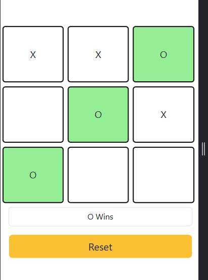

# 🕹️ Tic Tac Toe Game

A simple and fun **Tic Tac Toe** game built using **HTML**, **CSS**, and **JavaScript**. Challenge your friends in this classic two-player board game!

## 📸 Preview



> *(Add a screenshot of the game and name it `screenshot.png` or change the filename above.)*

---

## 🎮 How to Play

1. The game is played on a 3x3 grid.
2. Player 1 is `X` and Player 2 is `O`.
3. Players take turns placing their marks in empty squares.
4. The first player to get **three of their marks in a row** (vertically, horizontally, or diagonally) wins.
5. If all 9 squares are filled without a winner, the game is a **draw**.

---

## 🛠️ Technologies Used

- **HTML** – for the structure
- **CSS** – for styling and layout
- **JavaScript** – for game logic and interactivity

---

## 🚀 How to Run

1. Clone this repository or download the ZIP:
   ```bash
   git clone https://github.com/your-username/tic-tac-toe.git
